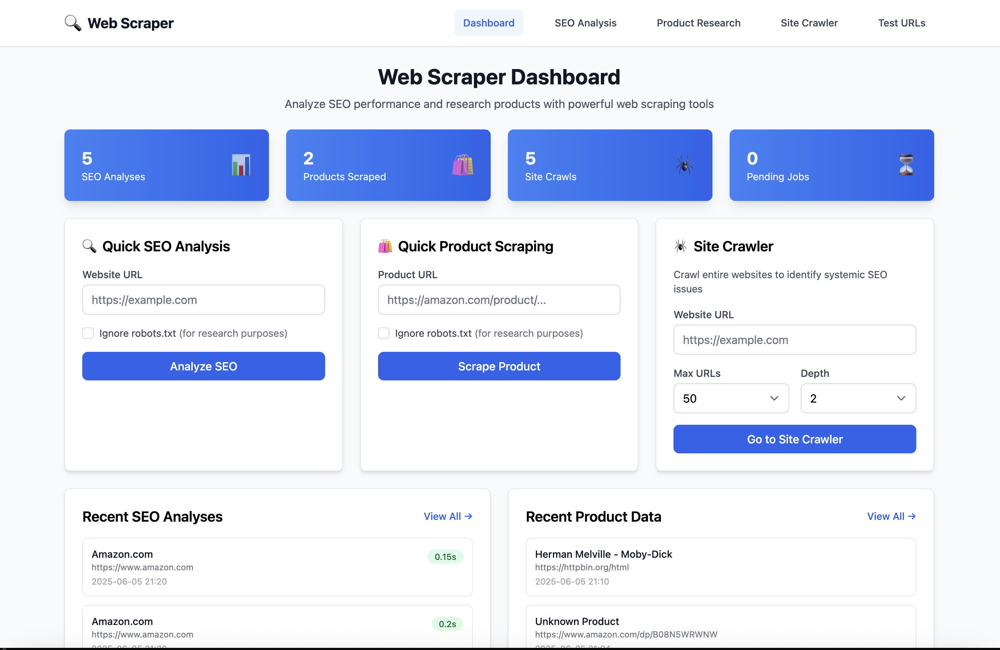

# 🕷️ Web Scraper & SEO Crawler

[](https://python.org)
[](https://flask.palletsprojects.com/)
[](LICENSE)
[](CONTRIBUTING.md)

A powerful, open-source web scraping and SEO analysis tool with comprehensive site crawling capabilities. Perfect for SEO professionals, developers, and researchers who need detailed website analysis and competitive research tools.



> **Dashboard Overview**: The main interface showing SEO analysis, product scraping, and site crawler tools with real-time statistics and recent activity.

## ✨ Features

### 🔍 **SEO Analysis**
- **Complete SEO Audits** - Meta tags, headers, performance, mobile-friendliness
- **Issue Detection** - Identifies 15+ types of SEO problems with severity levels
- **Performance Metrics** - Page load times, content analysis, keyword density
- **Mobile Optimization** - Viewport and responsive design checks

### 🕷️ **Site Crawler**
- **Intelligent Discovery** - Finds URLs via sitemaps and link crawling
- **Batch Analysis** - Analyze entire websites (up to 200 pages)
- **Systemic Issues** - Identify patterns and common problems across sites
- **Detailed Reporting** - Comprehensive results with filtering and export

### 🛍️ **Product Research**
- **Multi-Platform Support** - Amazon, eBay, and generic e-commerce sites
- **Product Details** - Names, prices, descriptions, availability, reviews
- **Price Tracking** - Monitor product prices over time
- **Brand Analysis** - Extract brand and category information

### 🤖 **Robots.txt Compliance**
- **Ethical by Default** - Respects robots.txt automatically
- **Research Override** - Option to ignore for legitimate research
- **Transparent Reporting** - Clear status on compliance for each request

### 📊 **Data Management**
- **TinyDB Storage** - Lightweight, JSON-based local database
- **Export Options** - CSV and JSON export formats
- **Historical Tracking** - Monitor analysis history and trends
- **Dashboard** - Beautiful overview with statistics and recent activity

## 🚀 Quick Start

### Prerequisites
- Python 3.9+
- Node.js 14+ (for Tailwind CSS)

### Installation

```bash
# Clone the repository
git clone https://github.com/websitebutlers/web-scraper-crawler.git
cd web-scraper-crawler

# Create virtual environment
python -m venv venv
source venv/bin/activate  # On Windows: venv\Scripts\activate

# Install dependencies
pip install -r requirements.txt
npm install

# Build CSS
npm run build-css

# Run the application
python app.py
```

Open your browser and navigate to `http://localhost:5000`

## 📖 Usage

### 🏠 Dashboard
The main dashboard provides an overview of your scraping activities:
- **Statistics Cards**: View counts of SEO analyses, products scraped, site crawls, and pending jobs
- **Quick Actions**: Rapid access to SEO analysis, product scraping, and site crawler
- **Recent Activity**: See your latest analyses and scraped data

### 🔍 SEO Analysis
1. Navigate to **SEO Analysis**
2. Enter a website URL (e.g., `https://example.com`)
3. Choose whether to respect robots.txt (default: yes)
4. Click **"Analyze SEO"** to get comprehensive insights
5. View detailed results including:
   - SEO score and performance metrics
   - Meta tags analysis (title, description)
   - Header structure (H1, H2 tags)
   - Page load time and word count
   - Mobile-friendly status
   - Identified SEO issues with recommendations

### 🕷️ Site Crawler
1. Go to **Site Crawler**
2. Enter a website URL
3. Configure crawl settings:
   - **Max URLs**: Limit the number of pages to crawl (up to 200)
   - **Max Depth**: Control how deep to crawl from the starting page
   - **Robots.txt**: Choose whether to respect robots.txt
4. Click **"Start Crawl"** to begin site analysis
5. Monitor progress and view results:
   - Systemic SEO issues across the site
   - Page-by-page analysis with filtering options
   - Export results in CSV or JSON format

### 🛍️ Product Research
1. Visit **Product Research**
2. Enter product URLs from supported platforms:
   - **Amazon**: `https://amazon.com/dp/PRODUCT_ID`
   - **eBay**: `https://ebay.com/itm/ITEM_ID`
   - **Other e-commerce sites**: Generic product pages
3. Choose robots.txt compliance settings
4. Click **"Scrape Product"** to extract data
5. View extracted information:
   - Product name, description, and specifications
   - Current price and availability status
   - Brand and category information
   - Customer ratings and review counts

## 🔧 API Usage

### SEO Analysis
```bash
curl -X POST http://localhost:5000/api/analyze-seo \
  -H "Content-Type: application/json" \
  -d '{"url": "https://example.com"}'
```

### Site Crawling
```bash
curl -X POST http://localhost:5000/api/crawl-site \
  -H "Content-Type: application/json" \
  -d '{
    "url": "https://example.com",
    "max_urls": 50,
    "max_depth": 2,
    "respect_robots": true
  }'
```

### Product Scraping
```bash
curl -X POST http://localhost:5000/api/scrape-product \
  -H "Content-Type: application/json" \
  -d '{"url": "https://amazon.com/dp/PRODUCT_ID"}'
```

## ⚙️ Configuration

Create a `.env` file for custom settings:

```env
SECRET_KEY=your-secret-key-here
REQUEST_TIMEOUT=30
MAX_RETRIES=3
REQUESTS_PER_SECOND=1
RESPECT_ROBOTS_TXT=true
```

## 📁 Project Structure

```
web-scraper-crawler/
├── app.py                    # Main Flask application
├── config.py                 # Configuration settings
├── requirements.txt          # Python dependencies
├── package.json             # Node.js dependencies
├── models/
│   └── database.py          # Database models and management
├── scrapers/
│   ├── seo_scraper.py       # SEO analysis engine
│   ├── product_scraper.py   # Product scraping logic
│   └── site_crawler.py      # Site crawling engine
├── utils/
│   ├── helpers.py           # Utility functions
│   └── seo_analyzer.py      # SEO issue detection
├── templates/               # HTML templates
└── static/                  # CSS, JS, and assets
```

## 🛡️ Ethical Usage

This tool is designed for legitimate research and analysis:

- ✅ **Respects robots.txt by default**
- ✅ **Built-in rate limiting**
- ✅ **Transparent compliance reporting**
- ✅ **Educational and research focused**

**Please use responsibly:**
- Always check website terms of service
- Use robots.txt override only for legitimate research
- Implement appropriate delays between requests
- Respect server resources and bandwidth

## 🤝 Contributing

We welcome contributions! Please see our [Contributing Guide](CONTRIBUTING.md) for details.

1. Fork the repository
2. Create a feature branch (`git checkout -b feature/amazing-feature`)
3. Commit your changes (`git commit -m 'Add amazing feature'`)
4. Push to the branch (`git push origin feature/amazing-feature`)
5. Open a Pull Request

## 📄 License

This project is licensed under the MIT License - see the [LICENSE](LICENSE) file for details.

## 🙏 Acknowledgments

- Built with [Flask](https://flask.palletsprojects.com/) and [Tailwind CSS](https://tailwindcss.com/)
- Uses [BeautifulSoup](https://www.crummy.com/software/BeautifulSoup/) for HTML parsing
- Database powered by [TinyDB](https://tinydb.readthedocs.io/)

## 📞 Support

- 🐛 **Bug Reports**: [Open an issue](https://github.com/websitebutlers/web-scraper-crawler/issues)
- 💡 **Feature Requests**: [Start a discussion](https://github.com/websitebutlers/web-scraper-crawler/discussions)
- 📖 **Documentation**: Check our [Wiki](https://github.com/websitebutlers/web-scraper-crawler/wiki)

---

**Made with ❤️ for the SEO and web development community**
